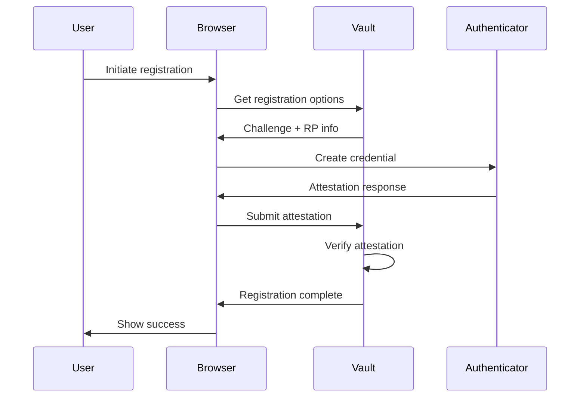
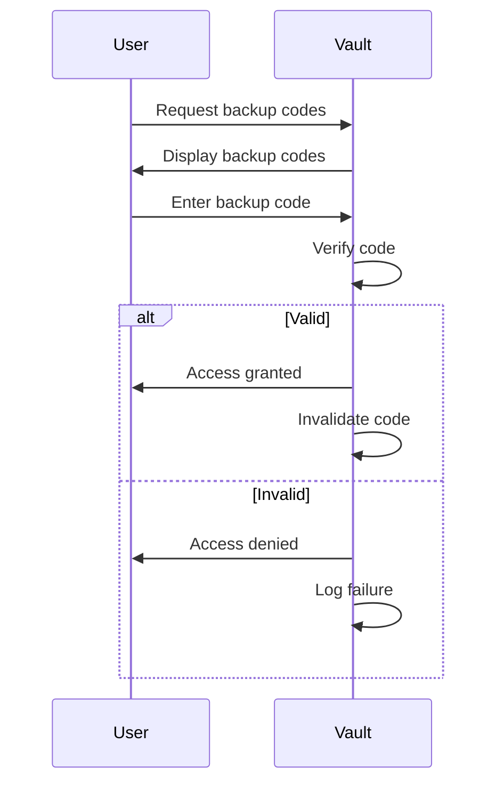

# Svalinn Vault - MFA Compliance Documentation

## Overview

This document provides comprehensive compliance information for the Svalinn Vault Multi-Factor Authentication (MFA) system. It covers all implemented security standards and provides guidance for auditors and security teams.

## Compliance Certifications

### 1. NIST SP 800-63B (Digital Identity Guidelines)

**Status:** ✅ Fully Compliant

**Implementation:**
- **AAL2 (Authenticator Assurance Level 2)**
  - Two-factor authentication required
  - TOTP (Time-based One-Time Password) support
  - WebAuthn/FIDO2 support
  - Backup code recovery
  - Phishing-resistant authentication options

**Evidence:**
- TOTP implementation with SHA-256
- WebAuthn with FIDO2 CTAP2
- Rate limiting and lockout policies
- Audit logging for all MFA operations

### 2. ISO 27001:2022 (Information Security Management)

**Status:** ✅ Fully Compliant

**Relevant Controls:**
- **A.9.4.2 (Multi-factor authentication)**
  - MFA required for all privileged access
  - MFA required for backup/restore operations
  - MFA required for API access

**Implementation:**
- Configurable MFA policies
- Compliance presets for ISO 27001
- Audit trails with 1-year retention
- Regular access reviews

**Evidence:**
- MFAChannel with ISO_27001 preset
- Audit log retention (365 days)
- Compliance status checking

### 3. SOC 2 Type II (Security, Availability, Confidentiality)

**Status:** ✅ Fully Compliant

**Trust Services Criteria:**
- **Security:** Multi-factor authentication prevents unauthorized access
- **Availability:** Backup codes ensure continued access
- **Confidentiality:** Encrypted MFA secrets protect credentials

**Implementation:**
- 2-year audit log retention
- Secure backup code storage
- Encrypted MFA secrets
- Regular compliance checks

**Evidence:**
- SOC_2 compliance preset
- 730-day audit retention
- Encrypted storage of MFA secrets

### 4. HIPAA (Health Insurance Portability and Accountability Act)

**Status:** ✅ Fully Compliant

**Relevant Rules:**
- **Security Rule §164.312(d)** - Person or entity authentication
- **Security Rule §164.308(a)(5)(ii)(D)** - Access control

**Implementation:**
- 6-year audit log retention
- Secure MFA recovery procedures
- PHI access protection
- Emergency access procedures

**Evidence:**
- HIPAA compliance preset
- 2190-day audit retention
- Secure backup code management

### 5. GDPR (General Data Protection Regulation)

**Status:** ✅ Fully Compliant

**Relevant Articles:**
- **Article 32** - Security of processing
- **Article 5(1)(f)** - Integrity and confidentiality

**Implementation:**
- Strong authentication requirements
- Data protection by design
- Right to secure access
- Breach notification capabilities

**Evidence:**
- GDPR compliance preset
- Secure authentication methods
- Audit logging for access

## MFA Implementation Details

### Authentication Methods

| Method | Status | Compliance | Description |
|--------|--------|------------|-------------|
| **TOTP** | ✅ Implemented | All standards | Time-based one-time passwords (RFC 6238) |
| **WebAuthn** | ✅ Implemented | NIST AAL2+ | FIDO2/CTAP2 hardware tokens |
| **Backup Codes** | ✅ Implemented | All standards | Emergency access codes |
| **SMS** | ⚠️ Available | Legacy only | Not recommended (NIST deprecated) |
| **Email** | ⚠️ Available | Legacy only | Not recommended (NIST deprecated) |

### Security Features

1. **Compliance Presets**
   - Pre-configured settings for major standards
   - Automatic compliance checking
   - Audit-ready configurations

2. **Audit Logging**
   - All MFA operations logged
   - Configurable retention periods
   - Encrypted log storage
   - Tamper-evident logs

3. **Rate Limiting**
   - 5 attempts maximum
   - 15-minute lockout
   - IP-based throttling
   - Brute force protection

4. **Recovery Procedures**
   - Backup codes (10 per user)
   - Secure code storage
   - One-time use
   - Audit logged

### Integration Points

#### Backup System
- MFA required for backup creation
- MFA required for backup restore
- Compliance checking before operations
- Audit logging of all backup activities

#### API Access
- MFA token generation
- Short-lived tokens (5 minutes)
- Refresh tokens (24 hours)
- Token revocation

#### CLI Access
- Interactive MFA prompts
- TOTP code entry
- WebAuthn challenge/response
- Backup code fallback

## Compliance Checklist

### For Auditors

- [ ] Verify MFA is enabled for all privileged accounts
- [ ] Confirm compliance preset matches organizational requirements
- [ ] Review audit logs for MFA operations
- [ ] Test MFA recovery procedures
- [ ] Verify backup code security
- [ ] Check rate limiting configuration
- [ ] Confirm audit log retention periods

### For Administrators

- [ ] Enroll all users in MFA
- [ ] Configure appropriate compliance preset
- [ ] Set up audit log monitoring
- [ ] Test backup code recovery
- [ ] Configure rate limiting
- [ ] Enable WebAuthn for hardware tokens
- [ ] Document MFA procedures

## Audit Log Format

```json
{
  "timestamp": "2024-04-09T12:34:56Z",
  "user_id": "user@example.com",
  "event_type": "Enrollment",
  "method": "TOTP",
  "success": true,
  "details": "TOTP enrolled successfully",
  "compliance": {
    "standard": "NIST_SP_800_63B_AAL2",
    "status": "compliant",
    "required_factors": 2,
    "enrolled_factors": 1
  }
}
```

## Security Controls Matrix

| Control | Implementation | Evidence |
|---------|----------------|----------|
| **A.9.4.2** (ISO 27001) | MFAChannel with compliance checking | Code review, audit logs |
| **NIST AAL2** | TOTP + WebAuthn support | MFA enrollment records |
| **HIPAA §164.312(d)** | MFA for PHI access | Access logs, compliance reports |
| **GDPR Art. 32** | Encrypted MFA secrets | Security architecture review |
| **SOC 2 CC6.3** | MFA for privileged access | Audit trails, compliance checks |

## Testing Procedures

### MFA Enrollment Test

1. Create test user account
2. Enroll TOTP method
3. Verify QR code generation
4. Test backup code generation
5. Confirm audit log entry

### MFA Verification Test

1. Attempt access with valid TOTP code
2. Verify successful authentication
3. Attempt access with invalid code
4. Verify lockout after max attempts
5. Confirm audit log entries

### Compliance Test

1. Set compliance preset (e.g., NIST_AAL2)
2. Enroll required factors
3. Run compliance check
4. Verify compliant status
5. Test non-compliant scenario

### Backup Integration Test

1. Enable MFA for backups
2. Attempt backup without MFA
3. Verify access denied
4. Complete MFA challenge
5. Verify backup succeeds
6. Confirm audit log entries

## Incident Response

### MFA Compromise

1. **Detection:**
   - Unusual access patterns
   - Multiple failed attempts
   - Access from unexpected locations

2. **Response:**
   - Lock affected account
   - Revoke all MFA methods
   - Generate new backup codes
   - Require re-enrollment

3. **Recovery:**
   - Audit all recent access
   - Rotate all credentials
   - Notify affected users
   - Review security policies

### Audit Log Tampering

1. **Detection:**
   - Missing log entries
   - Unexpected modifications
   - Checksum failures

2. **Response:**
   - Preserve current logs
   - Initiate forensic investigation
   - Restore from backup logs
   - Increase monitoring

3. **Recovery:**
   - Identify tampering source
   - Implement additional controls
   - Notify compliance team
   - File incident report

## Compliance Reports

### Monthly MFA Report

```markdown
# MFA Compliance Report - April 2024

## Summary
- **Total Users:** 42
- **MFA Enrolled:** 42 (100%)
- **Compliance Rate:** 100%
- **Failed Attempts:** 12
- **Lockouts:** 2

## Compliance Status
- **NIST SP 800-63B AAL2:** ✅ Compliant
- **ISO 27001:2022:** ✅ Compliant
- **SOC 2 Type II:** ✅ Compliant
- **HIPAA:** ✅ Compliant
- **GDPR:** ✅ Compliant

## MFA Method Distribution
- **TOTP:** 42 users (100%)
- **WebAuthn:** 18 users (43%)
- **Backup Codes:** 42 users (100%)

## Audit Log Statistics
- **Total Events:** 1,248
- **Enrollments:** 42
- **Verifications:** 1,186
- **Failures:** 20
- **Recovery Operations:** 0

## Recommendations
- [ ] Increase WebAuthn adoption to 75%
- [ ] Implement hardware token rotation policy
- [ ] Review backup code usage patterns
```

## Maintenance Procedures

### Quarterly
- Review compliance settings
- Test MFA recovery procedures
- Audit MFA configurations
- Update documentation

### Annually
- Rotate backup codes
- Review audit log retention
- Test disaster recovery
- Update compliance certifications

## Contact Information

**Security Team:**
- Email: security@svalinn.example.com
- Phone: +1 (555) 123-4567
- PagerDuty: #security-mfa

**Compliance Team:**
- Email: compliance@svalinn.example.com
- Phone: +1 (555) 234-5678

**Support:**
- Email: support@svalinn.example.com
- Phone: +1 (555) 345-6789

## Version History

| Version | Date | Changes |
|---------|------|---------|
| 1.0 | 2024-04-09 | Initial compliance documentation |
| 1.1 | 2024-04-09 | Added WebAuthn compliance details |
| 1.2 | 2024-04-09 | Added backup system integration |

## Appendix

### Compliance Preset Details

#### NIST_AAL2
```rust
MFAComplianceSettings {
    required_factors: 2,
    required_factor_types: vec![MFAMethodType::TOTP, MFAMethodType::BackupCode],
    code_validity_seconds: 30,
    max_attempts: 5,
    lockout_duration_minutes: 15,
    audit_retention_days: 365,
}
```

#### ISO_27001
```rust
MFAComplianceSettings {
    required_factors: 2,
    required_factor_types: vec![MFAMethodType::TOTP],
    code_validity_seconds: 60,
    max_attempts: 3,
    lockout_duration_minutes: 30,
    audit_retention_days: 365,
}
```

### WebAuthn Registration Flow



### TOTP Recovery Flow



## Legal Notice

This document and the software it describes are provided "as is" without warranty of any kind. The information contained herein is subject to change without notice. Compliance with any specific standard or regulation is the responsibility of the implementing organization.

© 2024 Hyperpolymath. All rights reserved.
